# Voxel-Sim Architect

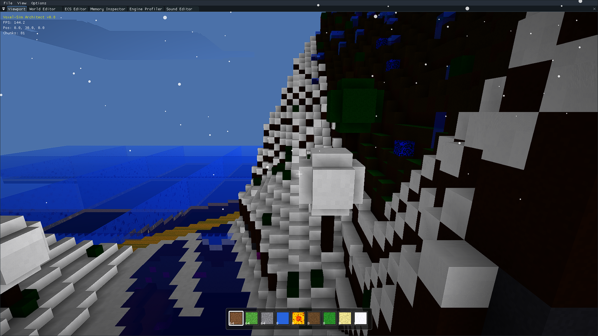

Voxel-Sim Architect is a high-performance, feature-rich voxel engine built from the ground up in C++ and OpenGL. It focuses on procedural generation, realistic fluid physics, and advanced visual effects while maintaining high performance through custom memory management and multi-threading.

## 🌍 World & Procedural Generation

-   **Multi-Noise Terrain**: Uses 5+ layers of `FastNoiseLite` (Continental, Biome, Mountain, River, and MountainMix) to create diverse landscapes.
-   **Diverse Biomes**:
    -   **Polar & Snowy**: Massive frozen regions with active snowfall and ice.
    -   **Jungle**: Dense vegetation with tall trees and vines.
    -   **Desert**: Vast sand dunes and cacti.
    -   **Volcano**: High-altitude peaks with flowing lava and obsidian.
    -   **Plains & Forests**: Rolling hills with Oak, Birch, and Cherry trees.

|                  Forest & Mountains                  |              Polar Biome               |
| :--------------------------------------------------: | :------------------------------------: |
| 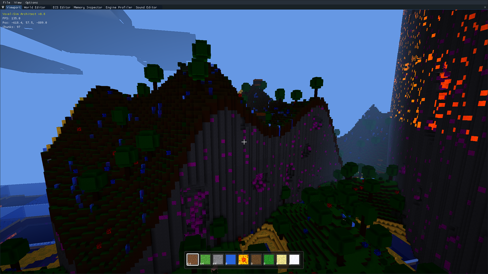 | 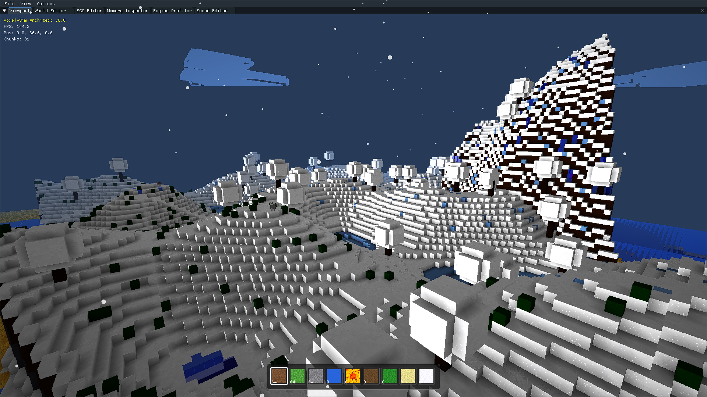 |

|                 Desert at Night                  |               Volcano Biome                |
| :----------------------------------------------: | :----------------------------------------: |
| 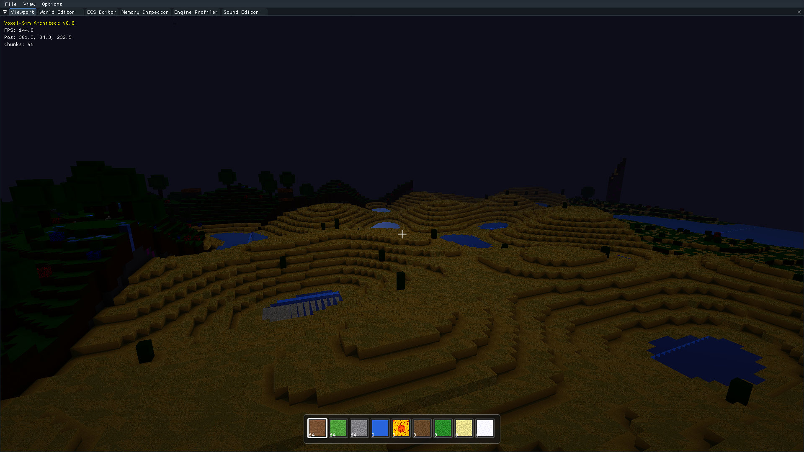 | 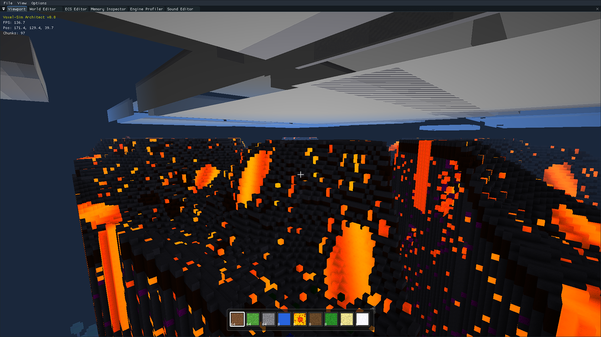 |

-   **Procedural Structures**: Automated generation of trees (Oak, Birch, Cherry, Jungle), cacti, and flowers.
-   **Ore Generation**: Realistic distribution of Coal, Iron, Gold, and Diamond ores deep underground.
-   **World Editor**: Real-time terrain and biome tweaking via integrated tools.
    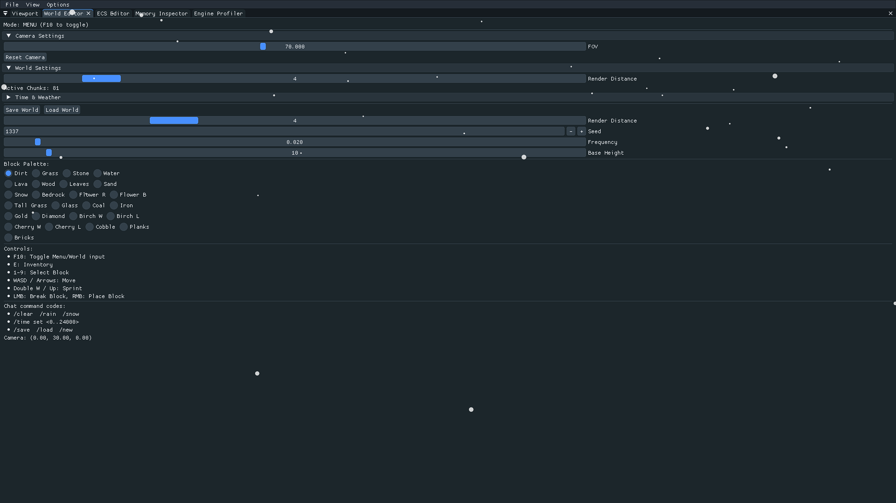

## 💧 Advanced Fluid Physics

-   **Minecraft-Style Simulation**: Water and Lava behave with realistic flow logic.
-   **Flow Rules**: Fluids prioritize downward movement before spreading horizontally.
-   **Immediate Updates**: Breaking a block next to a fluid source triggers instant propagation.
-   **Visual Effects**: Animated textures with scrolling, distortion, and light-bleed (lava glow).

## 🔊 Professional Audio System

-   **Dynamic Ambience**: Positional 3D audio for Water, Lava, and Fire that fades realistically with distance.
-   **Atmospheric Music**: Procedurally generated melodic music with chord progressions (Maj7/9th) and low-pass filtering.
-   **Material Physics**: Unique, realistic sound textures for Stone (heavy thud), Wood (hollow resonance), Grass (crispy crunch), and Glass (brittle shatter).
-   **Weather Audio**: Positional 3D Rain and powerful, cinematic 3D Thunder with sub-bass rumbles.
-   **In-Game Mixer**: Dedicated Sound Editor for controlling Master, Music, Mobs, and Block volumes in real-time.
    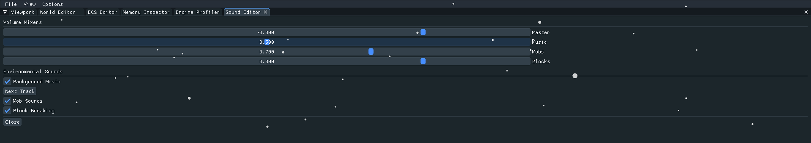

## ✨ Visuals & Rendering

-   **Advanced Shaders**:
    -   **Dynamic Day/Night Cycle**: Smooth transitions between sun and moon with color-shifting skies.
    -   **Atmospheric Effects**: Distance-based fog, sun halos, and vignette.
    -   **Snow Sparkle**: Procedural glinting on snow surfaces that changes with the camera angle.
    -   **Water Transparency**: Translucent water with Fresnel reflections and specular highlights.
-   **Weather System**: Active snowfall particles in cold biomes that wrap around the player.
-   **Precision Rendering**: Optimized near-plane clipping (0.05f) for close-up block interaction.

## 🐾 Entities & Gameplay

-   **Mob System**: Interactive entities including Cows, Pigs, Sheep, Chickens, Dogs, Cats, and aquatic life (Fish, Salmon, Octopuses).
-   **Basic AI**: Mobs feature wandering behavior and environmental awareness.
-   **Inventory & Interaction**:
    -   9-slot hotbar with textured icons.
    -   Block placement and breaking with progressive crack overlays.
        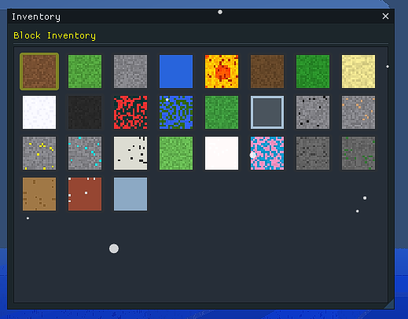
-   **Physics**: Sliding collision detection with automatic 1.1f step-up for smooth navigation over blocks.

## 🛠️ Engine Architecture

-   **Custom Memory Management**: Uses **Arena** and **Pool** allocators to minimize fragmentation and overhead.
-   **Multi-threaded Task Scheduler**: Offloads chunk generation and meshing to worker threads for stutter-free exploration.
-   **Integrated GUI**: Real-time profiling, memory tracking, and ECS editing.

|                ECS Editor                 |               Engine Profiler                |                   Memory Inspector                    |
| :---------------------------------------: | :------------------------------------------: | :---------------------------------------------------: |
| 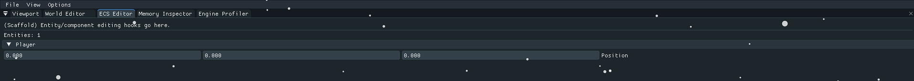 | 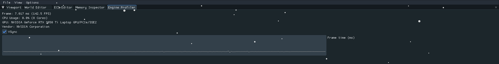 | 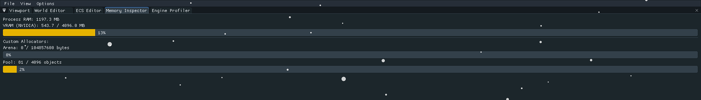 |

## 🎮 Controls

-   **WASD**: Move
-   **Space**: Jump / Swim Up / Fly Up
-   **Left Shift**: Fly Down
-   **Left Control**: Sprint
-   **1-9**: Select Hotbar Slot
-   **Left Click**: Break Block
-   **Right Click**: Place Block
-   **E**: Toggle Inventory
-   **T**: Open Chat
-   **F1**: Toggle Debug UI

## 🚀 Building

### Prerequisites

-   **CMake 3.20+**
-   **C++20 Compiler** (MSVC, GCC, or Clang)
-   **OpenGL 3.3+**

### Build Instructions

```bash
mkdir build
cd build
cmake ..
cmake --build . --config Release
```

## 📜 License

This project is licensed under the MIT License - see the [LICENSE](LICENSE) file for details.
